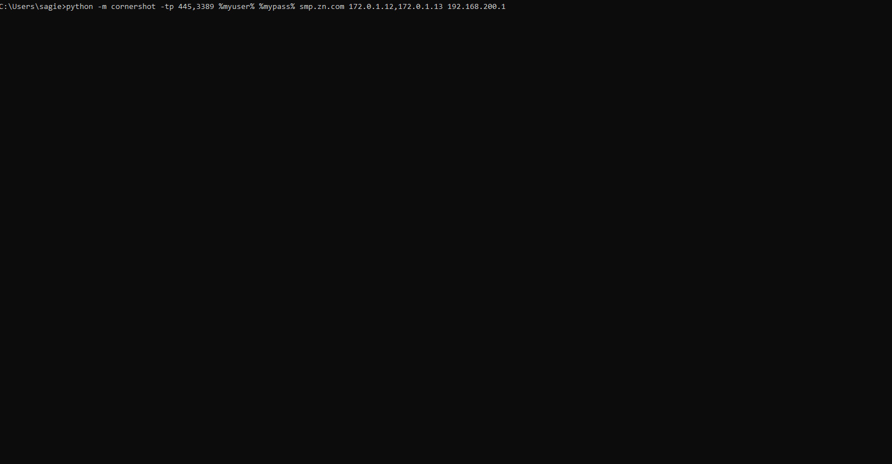

# What is CornerShot
In warfare, CornerShot is a weapon that allows a soldier to look past a corner (and possibly take a shot), without risking exposure.
Similarly, the CornerShot package allows one to look at a remote host’s network access without the need to have any special privileges on that host.

Using CornerShot, a **source**, with network access to **carrier**, can determine whether there is network access between the **carrier** and **target** for a specific port **p**.

For example, let's assume an red team is trying to propagate from a "compromised" source host A, to a target host X, for which host A has no access to. 
If they propagate through host B, only then they will discover that there is not network access between host B and X. 

By using CornerShot, the team can discover that host C actually has access to target X, so propagation towards target X should go through host C first.   

```
+-----+        +-----+          +-----+
|     |        |     | filtered |     |
|  A  +-------->  B  +----X--->(p) X  |
|     |        |     |          |     |
+-----+        +-----+          +-(p)-+
 source      carrier        target
   +                               ^
   |                               |
   |           +-----+             |
   |           |     |   open      |
   +---------->+  C  +-------------+
               |     |
               +-----+


```

Similarly to [nmap](https://nmap.org/), CornerShot differentiates between the following state of ports: *open*,*closed*, *filtered* and *unknown* (if it can't be determined).

The following demo shows running CornerShot against two carriers hosts 172.0.1.12 & 172.0.1.13, in order to determine if the have network access to 192.168.200.1:

  

Read more [here](https://zeronetworks.com/blog/adversary-resilience-via-least-privilege-networking-part-1/).

# Use Cases

## Single Deployment for Complete Network Visibility
The seemingly simple task of identifying if some host B in the network has access to host C may require large deployment of network sensors, device agents or collection of a multitude of firewall rules, router configurations and host policies. 

CornerShot can simplify this process by using one (or very few) agents that can query other hosts in the network, to determine their access to remote hosts.  
  
## Validate BloodHound Paths
Security teams that utilize BloodHound to find, and mitigate, privilege escalation paths inside their network, often struggle with millions of logical paths discovered by BloodHound.

[ShotHound](https://github.com/zeronetworks/BloodHound-Tools/tree/main/ShotHound) is a tool that integrated CornerShot with BloodHound, in order to discover practical paths that are supported by network access. 

# Getting Started
CornerShot can be used as a package, or as a standalone module. The only requirements are Python 3 and the impacket package.

## Installation 

```bash
pip install cornershot
```

## Standalone Usage

Basic usage requires credentials from a valid domain user, a FQDN domain, a carrier IP and target IP.
```bash
python -m cornershot <user> <password> <domain> <carrier> <target>
```

To scan a range of carriers against a range of targets, subnets or IP ranges may be used in a comma delimited list:
```bash
python -m cornershot <user> <password> <domain> 192.168.1.10-192.168.1.20 192.168.5.0/24,192.168.6.0/24
```

By default, CornerShot will try to scan the following ports: 135, 445, 3389, 5985, 5986. The user can provide a comma delimited list of ports and port ranges:
```bash
python -m cornershot -tp 22,8080,45000-45005 <user> <password> <domain> <carrier> <target>
```  

## As a Package
Within code, one needs to instantiate a CornerShot object with the username, password and domain name of a valid domain user. 
Adding carriers, target and ports is achieved via the *add_shots* method. Once ready, the *open_fire* method can be called, which performs only the relevant RPC calls based on the required ports.  

```python
from cornershot import CornerShot
cs = CornerShot("username", "password", "fqdn")
cs.add_shots(carriers=["192.168.1.1"],targets=["192.168.1.2","192.168.1.3"])
cs.lock_and_load()
results = cs.open_fire()
```

The result of *open_fire* is a dictionary with keys of carriers, each carrier has another set of keys for targets, and finally, each target holds a dictionary of ports and their respective states. 
This is an example format of a result: 
```javascript
{'carrier_1': 
	{'target_1': 
		{135: 'unknown', 445: 'filtered', 3389: 'filtered', 5986: 'filtered', 5985: 'filtered'},
	'target_2': 
		{135: 'unknown', 445: 'open', 5985: 'unknown', 5986: 'filtered', 3389: 'open'}
	}, 
'carrier_2': 
	{'target_1': 
		{3389: 'filtered', 135: 'filtered', 5985: 'filtered', 445: 'filtered', 5986: 'unknown'}, 
	'target_2': 
		{5985: 'filtered', 5986: 'filtered', 445: 'filtered', 135: 'filtered', 3389: 'open'}
	}
}
```

# How CornerShot Works?

CornerShot relies on various, well documented, standard Remote Procedure Call (RPC) methods that are used by various Microsoft services. 
By using methods that only require an authenticated account in the domain, CornerShot is able to trigger network traffic from a carrier host to a target.

CornerShot is able to determine the remote's port state by measuring the time an RPC call took, and using different error codes for each RPC method.

## RPC Methods

The reader may be familiar with the ["printer bug"](https://www.slideshare.net/harmj0y/derbycon-the-unintended-risks-of-trusting-active-directory/41), which was discovered by [Lee Christensen](https://twitter.com/tifkin_). While it is called a bug, it is a well documented behaviour of the printing service, which allows any authenticated user to coerce a remote server to authenticate to any machine, using the [RpcRemoteFindFirstPrinterChangeNotificationEx](https://docs.microsoft.com/en-us/openspecs/windows_protocols/ms-rprn/eb66b221-1c1f-4249-b8bc-c5befec2314d) method.     
  
CornerShot utilizes the following RPC methods from several Microsoft protocols (there are many additional methods, which will be implemented in future versions): 
 - RPRN    : [RpcOpenPrinter](https://docs.microsoft.com/en-us/openspecs/windows_protocols/ms-rprn/989357e2-446e-4872-bb38-1dce21e1313f)
 - RRP     : [BaseRegSaveKey](https://docs.microsoft.com/en-us/openspecs/windows_protocols/ms-rrp/f022247d-6ef1-4f46-b195-7f60654f4a0d)
 - EVEN    : [ElfrOpenBELW](https://docs.microsoft.com/en-us/openspecs/windows_protocols/ms-even/4db1601c-7bc2-4d5c-8375-c58a6f8fc7e1)
 - EVEN6   : [EvtRpcOpenLogHandle](https://docs.microsoft.com/en-us/openspecs/windows_protocols/ms-even6/30a294b1-4e95-468a-a90a-185a5ea63ea0)
 
Implementation of the protocols themselves is achieved via the wonderful [impacket](https://github.com/SecureAuthCorp/impacket) package.
   
### RpcOpenPrinter
This method receives a [printerName](https://docs.microsoft.com/en-us/openspecs/windows_protocols/ms-rprn/24fcd124-035c-4988-a858-3a7d8d6f7b43) as parameter. 
The printerName name can be a path to a local file, a remote file or even to a web printer. By supplying a name that conforms with the WEB_PRINT_SERVER format, it is possible to query any remote port.
One example of a web print server name which will trigger HTTP traffic to a remote host and port is: "http://<target_ip>:<target_port>/printers/ppp/.printer".
### BaseRegSaveKey
To utilize this method, we need a two step approach: first, open a registry key on the remote host - which results with a valid handle, and second, try and save a backup of this handle to a remote file. 
The BaseRegSaveKey method receives a file path to which it can save a backup of a registry, which triggers SMB traffic over port 445 (and 135 as backup) to a target.
The registry key CornerShot opens is the HKEY_CURRENT_USER, which is open for reading by default on most client hosts.
### ElfrOpenBELW
This function tries to backup Windows events into a file path, which can be remote - in such a case the service will try and access the remote host and path.
### EvtRpcOpenLogHandle
Similarly to the EVEN method, only this method utilizes a different version of the Windows Events protocol, which is done directly over TCP - no need for SMB port to be open.
 
## Determining Port State
CornerShot estimates the remote ports' state based on timing factors and error messages received by the RPC method or underlying transport.
By experimenting with different Windows hosts and various RPC protocols, we came up with 3 different timing thresholds that prove to work in most network environments.
These thresholds are best illustrated with the following figure:
```
                +                           +                 +     
                |                           |                 |
     unknown    |       open / closed       |     filtered    |  open
     /          |                           |                 |
     open       |                           |                 |
                |                           |                 |
  +-------------+------------------+-----------------+--------------+
  0            0.5                          20                40    Seconds
               MIN                        FILTERED           UPPER  
``` 

The MIN threshold is 0.5 seconds, responses below this threshold either mean an error in the underlying RPC method or underlying transport, or a response could have been received from the target host.

Replies below FILTERED threshold of 20 seconds could indicate either an open or a closed port, depending on the type of error message received for the method. 

Replies between the FILTERED and UPPER threshold of 40 seconds indicate a filtered port for all tested methods (so far...). And requests taking more than the UPPER limit indicate a prolonged open TCP connection.

## OS support
Executing Corenershot against different OS versions and configurations will yield different results. Not all Windows versions have the same named pipes or behave the same when queried with the same RPC method. 
Most Windows OOTB will not expose SMB and other RPC services over the network, however, experience has shown that in large environments these ports tend to be open and accessible for most of the assets.

The following table shows default support for various RPC protocols, given that the appropriate ports are accessible to the carrier host and no configuration changes were made to the host: 

| OS            | Supported RPC Protocols   | Required Open Carrier Ports  | Possible Target Ports to Scan | 
| ------------- |:-------------------------:| --------------------------------:|  ---------------------------------:|
| Windows 7     | EVEN,EVEN6                |     445 / 135 & even6 tcp port   |            445*                    |
| Windows 8     | EVEN,EVEN6                |     445 / 135 & even6 tcp port   |            445*                    |
| Windows 10    | EVEN,EVEN6,RPRN           |     445 / 135 & even6 tcp port   |            **ANY**                 |
| Server 2008   | EVEN,EVEN6,RRP,RPRN**     |     445 / 135 & even6 tcp port   |            445                     |
| Server 2012   | EVEN,EVEN6,RRP,RPRN**     |     445 / 135 & even6 tcp port   |            445                     |
| Server 2016   | EVEN,EVEN6,RRP,RPRN**     |     445 / 135 & even6 tcp port   |            445                     |
| Server 2019   | EVEN,EVEN6,RRP,RPRN**     |     445 / 135 & even6 tcp port   |            445                     |

\* If Webclient service is running on a client machine, additional ports can be scanned. Currently CornerShot does not support this option.

\** RPRN protocol is supported on server hosts, however opening a remote web printer does not work (which is why we can't scan ANY target port) - until we find a workaround :wink:  

# Developers
Additional RPC shots, or any other contribution is welcome! 

All RPC methods are implemented under */shots*, and inherit from an abstract class named *BaseRPCShot*. 
The */example* folder shows how to create a custom RPC shot and use it in code.  

# License
CornerShot is released under the Apache 2.0 license. For more details see [LICENSE](https://github.com/zeronetworks/cornershot/blob/expansion_doc/LICENSE.txt).

# Contact Us
We are happy to hear from you! 
For bugs, patches, suggestions on this package, please contact us at [support@zeronetworks.com](mailto:support@zeronetworks.com)

